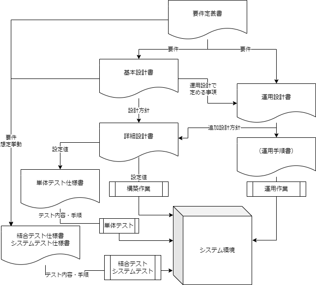

# seminar-aws-infra-design-work
勉強会のAWSインフラ要件定義から設計業務についての講義資料
## この講義のコンセプト

大きな目的としては、皆さんが基本設計業務が分かる・出来る！となることを目的としています。
副次的な目的として、システム設計構築プロジェクトの全体像についてイメージを持ってもらう事も目的としています。
ただし、以下のような前提の下にお話します。

- 基盤はAWSであることが前提です
- 具体例を挙げる際は、Webアプリケーションの基盤を想定します
- システム基本設計業務に関する話が中心です
- ウォーターフォール型プロジェクトでのフェーズの流れです

## 講義の流れ

以下のような組み立てでシリーズを進めて行きます。

- 複数の設計ドキュメント間の関係を示すことで、それぞれのドキュメントで書くべき範囲、他ドキュメントに任せた方が良い範囲をイメージしてもらう
- 各設計ドキュメントを作る目的を示すことで、中身としてどんなものを書くのかのフンワリしたイメージを持ってもらう
- 基本設計について、章立てや、各章にて抑えた方が良い事項について挙げておくことで、設計に抜け漏れが発生しないように
- 具体的な設計文章について、例となるようなものを示すことで、具体的なイメージを膨らましてもらう

## 各フェーズと成果物の概要
システム設計構築プロジェクトで作成されるドキュメント等の関係を示します。

各フェーズの概要について以下で説明していきます。
因みに、各フェーズの成果物となるドキュメントは、後工程で変更される場合があります。その変更理由について、以下は共通のものなので省きます。

- 上位のドキュメント変更にあわせての変更
- 後続の工程で実装が不可能であること等の考慮漏れが発覚した場合

### 要件定義
インフラにおける要件定義とは、主に非機能要件定義とネットワーク要件、そして構築対象となるサーバ種別（アプリサーバとかDBとか監視サーバとか）の3点について定義することになる。
ここで、以降の設計構築の対象とする範囲であったり、設計の中で満たすべき要件について合意形成する。

| 項目                 | 説明                                                                                                                                                 | 
| -------------------- | ---------------------------------------------------------------------------------------------------------------------------------------------------- | 
| インプット           | 基本的にこのフェーズのでのお客さんへのヒアリング事項（前フェーズの成果物として右記がある場合もある、提案書、システム企画書、以前のヒアリング事項等） | 
| やる事               | 要件のヒアリングとか提案などの話し合い                                                                                                               | 
| アウトプット         | 要件定義書（機能、非機能）、システム概要図（基本設計で変わることも多い）                                                                             | 
| 要件定義書の変更頻度 | 基本的に変えない（要件変更するときは顧客との要件の再定義の為の話合い、承認のプロセスを経る）                                                         | 
| 主な変更理由         | 要件漏れや何かインシデントが起きた等による要件追加                                                                                                   | 

### 基本設計
基本設計書は、システムが満たすべき機能をどのような構成で実現するのかという方式や、各設計要素の中での方針を示す文章です。
こういう目的でこういうものを使用するよー、理由はこうだよーというようなことを書いたりもする。
例えば、構築にはCloudFormationを使う。理由としては、構築作業のテンプレート化による作業効率化、ヒューマンエラーの減少を目的とする。とか。

| 項目                 | 説明                                                                                                                                                                                                                                                            | 
| -------------------- | --------------------------------------------------------------------------------------------------------------------------------------------------------------------------------------------------------------------------------------------------------------- | 
| インプット           | 要件定義書                                                                                                                                                                                                                                                      | 
| やる事               | 要件のヒアリングとか提案などの話し合い                                                                                                                                                                                                                          | 
| アウトプット         | 基本設計書                                                                                                                                                                                                                                                      | 
| 基本設計書の変更頻度 | あまり変えない                                                                                                                                                                                                                                                  | 
| 主な変更理由         | インフラ構成変更やOSやミドルウェアの変更。例えば、新しいサービスのリリースや、既存要素サポート切れ等によって、基本設計に書いてある要素（例えばOS, ミドルウェア, AWSサービス等）を変更する場合。機能の追加・削除によってサーバやサービス等を足したり消した場合。 | 

| 項目                 | 説明                                                                                                                                                                                                                                                            | 

基本設計書に書くこと
- システムの目的
- インフラ構成図
- 各サーバの設計方針や変わらない部分の具体的設計
- 各種非機能要件

### 詳細設計

| 項目                 | 説明                                                                                                                  | 
| -------------------- | --------------------------------------------------------------------------------------------------------------------- | 
| インプット           | 基本設計書                                                                                                            | 
| やる事               | 具体的パラメータの決定                                                                                                | 
| アウトプット         | 詳細設計書,パラメータシート                                                                                           | 
| 詳細設計書の変更頻度 | それなりに変わる                                                                                                      | 
| 主な変更理由         | 基本設計には影響のない軽微なパラメータ変更。例えば、CPU,メモリ,ストレージ容量等のスペック変更、監視しきい値の変更等。 | 

### 構築

| 項目         | 説明                             | 
| ------------ | -------------------------------- | 
| インプット   | 詳細設計書                       | 
| やる事       | 詳細設計書の通りに環境を構築する | 
| アウトプット | AWSインフラの実環境              | 

### 単体テスト

インフラの単体テストでは詳細設計に定めたパラメータ通りに実環境が構築されているかのチェックを行ないます。

| 項目         | 説明                             | 
| ------------ | -------------------------------- | 
| インプット   | 詳細設計書                       | 
| やる事       | 詳細設計書と実環境の設定値の突合 | 
| アウトプット | 単体テスト報告書                 | 

### 結合テスト・システムテスト

インフラの結合テストでは構築したリソース同士が意図した通りの挙動をするのか確認します。

例えば、疎通テスト（必要な通信は出来るか、逆に出来ないはずの通信が出来たりしないか？）、ロードバランサーにアクセスしたらちゃんとWebサーバにアクセスログが残るか？、アラーム通知テスト（監視しきい値を超えたらアラートメールがちゃんと届くか）をします。

| 項目         | 説明                                                         | 
| ------------ | ------------------------------------------------------------ | 
| インプット   | 要件定義書、基本設計書、詳細設計書                           | 
| やる事       | インフラが、意図したとおり、要件のとおりの挙動を示すかの確認 | 
| アウトプット | 結合テスト報告書、システムテスト報告書                       | 

### 運用設計

運用設計では、システムを運用していくにあたって継続的に行なっていく必要のある以下のような作業について設計をします。

- 設定変更
- 監視
- セキュリティ対策
- パッチ適用等のアップデート
- ログの退避やローテーション
- その他定期的に発生するイベントがあれば(証明書の更新とか、棚卸業務とか)

上記について、以下のようなことを設計します

- 体制・役割
- 基本設計に書いていない方式
- タイムスケジュール
- しきい値
- 通知先
- 対処フロー

| 項目         | 説明                                                                                             | 
| ------------ | ------------------------------------------------------------------------------------------------ | 
| インプット   | 要件定義書、基本設計書                                                                           | 
| やる事       | 主に非機能要件を満たす為に、システムに対してどのような事をどのように継続的に行っていくのかの設計 | 
| アウトプット | 運用設計書                                                                                       | 

運用設計の中では、運用手順書を作成することもあります

運用手順書は、運用設計に記載の運行作業についての詳細な手順です。文章のみで手順を書いた簡易なものから、スクリーンショット付きの丁寧な手順書までレベル感は色々です。
