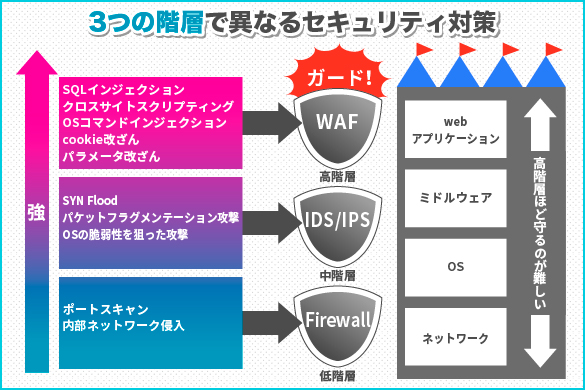

# 要件定義

要件定義とは、システム開発などのプロジェクトを始める前の段階で、必要な機能や要求をわかりやすくまとめていく作業のことです。企画の進行とともに要件定義に立ち返ることも多く、目的の脱線を防止する役割も果たします。

## 要件定義のインプット・成果物

### インプット
以下があれば
- システム企画書
- RFP
- 提案時の資料
- 想定構成図

後は大体以下
- ヒアリングや議論
- 要件の提案

### アウトプット

- 要件定義書
- （想定構成図）

## 要件定義で注意するべきこと

要件漏れ（後続フェーズで追加となると大きな影響がある場合がある）
設計構築フェーズでの対応範囲も定義する（あとあと揉めやすい）
ちゃんとお客さん側のキーマンとも合意取れているか（後でちゃぶ台返し食らわないように）
なるべく要件定義で定義しておくべき事を後回しにしない（後回しは顧客との合意の上で行う。ちゃんと記録をとっておき、管理も行っておく）

対象範囲（どんな範囲のものに対して）
適用事項（なにをやる）
タイミング（いつやる）

## 要件定義で定義すること

- 非機能要件(IPA)
    - 可用性
        - 稼働率
        - RPO/RTO/RLO
        - BCP・DR
    - 性能・拡張性
        - オンライン性能
        - バッチ性能
        - 性能拡張
            - 垂直スケール
            - 水平スケール
        - 容量拡張
    - セキュリティ
        - 脆弱性対策（パッチ）
	- ウィルス対策
	- 攻撃防御どんな攻撃を想定するか、どんな対策をするか
	- 暗号化
        - 監査
    - 保守・運用性
        - 監視
    - 移行性
    - システム環境・エコロジー

[IPA非機能要求グレード](https://www.ipa.go.jp/sec/softwareengineering/std/ent03-b.html)

- AWS
    - アカウント構成
    - VPC構成

- サーバ系要件
    - サーバ構成
    - インフラで担当する設計構築範囲
    - OS
    - ファイルシステム
    - ミドルウェア
    - DBエンジン
    - 名前解決
    - ドメイン
    - 時刻同期

- ネットワーク要件
    - VPC・AZ・サブネット構成
    - VPC内通信
    - WAN通信
        - 回線
    - インターネット通信
        - 業務系
        - 運用・保守系
    - 通信要件

- ログ要件
    - 取得・保管対象ログ
        - アクセス分析系
        - 障害調査系
        - 監査系
    - 保管要件
        - 期間
        - 暗号化有無

## 非機能要件
### 可用性
可用性（Availability）とは、システムが継続して稼動できる度合いや能力のことです。
インフラ構成(特に冗長構成)や、監視、バックアップ・リストアに関わる要件です。
以下では、可用性に関する要件定義の項目としてどのようなものがあるのかを見て行きます。

#### 稼働率

稼働率は、ある期間においてシステムが正常に稼動している割合をパーセンテージで表したものです。
この値はインフラだけで決めることは出来ません。何故なら、サービスの稼働率はアプリケーションも含めたシステム全体の稼動率を指すものだからです。とはいえ、サービスの稼働率はインフラの稼働率を超えることは出来ません。なので、インフラでもシステム稼働率を認識して、インフラの設計としてはこのくらいの稼働率ですよということはアプリケーションチームとも合意しておくべきでしょう。
また、稼働率に関して、その値がSLAなのか、ペナルティのない目標値なのかはキチンと確認が必要です。

| 項目                                                   | 定義する事                                                                                                                                                               | 例                                              | 
| ------------------------------------------------------ | ------------------------------------------------------------------------------------------------------------------------------------------------------------------------ | ----------------------------------------------- | 
| SLA(Service Level Agreement サービスレベル合意(保証))  | アップタイム、応答性、責任などの測定可能な指標に関する、プロバイダーとクライアント間の契約です。実稼働率がSLAにある値を下回った場合、何らかのペナルティが発生します。    | 稼働率99.9%。+ サービスが稼働している状況の定義 | 
| SLO(Service Level Objective サービスレベル目標)        | アップタイムや応答時間などの特定の指標に関する SLA 内の合意です。SLOはあくまで目標なので違反に対するペナルティはありません。そもそも利用者に開示されないこともあります。 | 稼働率99.5%                                     | 

私の経験では、多くの場合アプリチームとの話し合いでインフラの設計上の稼働率はこの数値で良いでしょうか？というような軽めの合意になることが多いです（そして大体目標値だけ）
キチンと定義するなら、システムが稼動しているとはどういう状態を指すか(例えば、ページのレスポンスの99.9パーセンタイルが0.5秒以内とか)まで決めたりしますが、そこまで定義することは実は稀です。が、SLAを定義する場合はそこまで定義しなければなりません。（返金するしないで後々揉めることになるので）

参考
[SLA、SLO、SLI の比較: 相違点は何か?](https://www.atlassian.com/ja/incident-management/kpis/sla-vs-slo-vs-sli)
[つかんでおきたい「SLA」と「SLO」のちがい](https://www.ntt.com/business/services/management/operations-management/global-management-one/column/sla_slo.html)
[稼働率とは？](https://atmarkit.itmedia.co.jp/icd/root/68/51739168.html)

#### 災害対策

AWS案件では、災害をどう定義するか？（AZ障害、リージョン障害、どこまで想定するか？）
それらの災害に対してどのような備えを行なうか？と言う話が焦点になります。

| 項目・定義する事                         | 例                                 | 
| ---------------------------------------- | ---------------------------------- | 
| 災害対策を行うか？想定する災害はなにか？ | リージョン障害を想定して対策を行う | 
| 災害からの復旧時間目標                   | 30日以内                           | 
| 復旧レベル                               | RLOと同じで良い                    | 
| 災害対策方式                             | バックアップ・リストア             | 

[AWS でのディザスタリカバリ (DR) アーキテクチャ、パートI：クラウドでのリカバリの戦略](https://aws.amazon.com/jp/blogs/news/disaster-recovery-dr-architecture-on-aws-part-1-strategies-for-recovery-in-the-cloud/)

関連用語
[DR(Disaster Recovery)](https://e-words.jp/w/ディザスタリカバリ.html)
[BCP(Business Continuity Plan)](https://e-words.jp/w/BCP.html)

### 性能・拡張性

性能とは、システムの処理能力を意味します。また、データの保存容量もある意味では性能と言えます。
拡張性とは、後から性能を上げることが出来るか？出来るならどのように拡張可能にするかという要件です。

性能はシステムとして見るものなので、インフラだけで性能要件を定義することは出来ません。アプリケーション担当側が性能についてお客さんと話をしていたりもしますので、アプリ担当からこのようなスペックのサーバを用意してくれと言われるパターンも多いです。
また、AWSにおいては、基本的にオンデマンドでインフラの性能を拡張・縮小することが出来るので、性能要件についてはあまり厳密に定義する必要はないのですが、そこそこの精度の見積を求められます（予算を取らないといけなかったり、予算と実際の乖離はなるべく無くしたい等の事情があり、、、）
拡張性で一つ大事なのは、垂直スケール戦略と水平スケール戦略のどちらを取るのかという事です。この点について、このサーバはこの戦略、このサーバはこうと言うように定義することになります。戦略の選択肢による制約についても合意しておくことが必要です。

定義項目についてはサーバ要件、ネットワーク要件の章で説明します。

### セキュリティ
システムがどのようなセキュリティ面のリスクを考慮して、予防・対処(対処の準備を含む)をするのかを定義します。
暗号化やログの保管に主に関わります。脆弱性対策や攻撃への備えなど、運用設計とも被る要件が多いです。なので、運用設計フェーズがあるのであれば、最低限以下を定義すれば、後は運用設計の中で定義することにしても良いかと思います。（とはいえ一旦ヒアリングしておくべきです）

- 保管対象となるログ(なければ取れるログはとっておいて、後で要らないログを捨てる)
- 暗号化（後から暗号化するのは大変な場合もあるので）
- ネットワークに関するアクセス制限（VPCやサブネット構成に変更が掛からないように）
- その他構築時に最低限やっておくセキュリティ対策

お客さんによっては、全社的なセキュリティ関連のポリシーを定めている場合もあります。まずはそのような既存のルールがないかを確認してみると良いでしょう。

[情報セキュリティって何？](https://www.soumu.go.jp/main_sosiki/joho_tsusin/security/intro/security/index.html)より

>   情報セキュリティという言葉は、一般的には、情報の機密性、完全性、可用性を確保することと定義されています。
>   機密性とは、ある情報へのアクセスを認められた人だけが、その情報にアクセスできる状態を確保すること。完全性とは、情報が破壊、改ざん又は消去されていない状態を確保すること。可用性とは、情報へのアクセスを認められた人が、必要時に中断することなく、情報にアクセスできる状態を確保することをいいます。

#### 脆弱性対策（パッチ）
パッチ適用に関する要件です。
パッチ適用を、例えばSSMのパッチマネージャを使う際に設計のインプットになる要件です。
一般的にどんなプログラムにも脆弱性（攻撃に弱い点）が含まれています。脆弱性は発見されるとそれを修正するパッチが提供されます（もちろんサポートを受けられるものに限る）。
パッチの適用は、インターネット公開のシステムでは絶対に行なうべきです。脆弱性の中には、攻撃を受けるとシステムが乗っ取られてしまうものもある為です。プライベートなネットワークで使われるシステムでも深刻度の高いパッチ適用は行なうべきですが、そのような運用をしない場合もあります。

| 項目                   | 定義する事                                   | 例                                                                            | 
| ---------------------- | -------------------------------------------- | ----------------------------------------------------------------------------- | 
| 適用対象               | OS種別や、サーバ種別                         | Windowサーバ全台を適用対象とする。また、LinuxサーバはDBサーバを適用対象にする | 
| 適用するもの           | パッチの緊急度に応じた適用方針               | CVSSスコアの緊急、重要のパッチを対象とする                                    | 
| 適用タイミング         | パッチ適用までのリードタイム                 | 緊急のものは3日以内、その他は1月以内                                          | 
| 動作テスト             | パッチ適用後にアプリの動作確認テストを行うか | 開発環境でテストを行う                                                        | 
| メンテナンスウィンドウ | パッチを適用する為の日時の指定があるか       | 毎月第1月曜日の午前2時から3時の間                                             | 

#### 攻撃対策・不正アクセス対策

システムへの悪意ある行動に対して予防等の対策を行なうかの要件です。どのような攻撃を想定して対策するのかを定義します。
各対策を行なうのであれば、どんな製品を採用して、どのサーバを対象に、どんなルール適用するのかも決めていくことになります。
項目によってはAWSのマネージドサービスでは提供していないものもあるので、サードパーティ製ツールの採用も含めて検討していく必要があります。製品によっては、1つで複数の対策が出来るものもあるのでうまく組み合わせて提案するのも良いでしょう。

- マルウェア（ウィルス）対策ソフト
- IPS（侵入防御）/IDS（侵入検知）
- WAF（Web Application Firewall）
- 改ざん検知
- DDoS対策

ウィルス対策ソフト
| 項目・定義する事                       | 例                       | 
| -------------------------------------- | ------------------------ | 
| ウィルス対策製品に指定のものはあるか？ | TrendMicro Deep Security | 
| 対象サーバはなにか？                   | 全Windowsサーバ          | 

IPS/IDS
| 項目・定義する事                  | 例                       | 
| --------------------------------- | ------------------------ | 
| IPS/IDS製品に指定のものはあるか？ | TrendMicro Deep Security | 
| 対象サーバはなにか？              | 全サーバ                 | 

WAF
| 項目・定義する事                  | 例                             | 
| --------------------------------- | ------------------------------ | 
| WAF製品に指定のものはあるか？     | 特になし                       | 
| 対象とする環境はなにか？          | ステージング環境および本番環境 | 
| WAFで防御する項目に指定はあるか？ | OWASP TOP10の項目              | 

改ざん検知
| 項目・定義する事                 | 例            | 
| -------------------------------- | ------------- | 
| 検知対象はどのようなデータか？   | Webコンテンツ | 
| 製品に指定のものはあるか？       | 特になし      | 
| 対象とする環境・サーバはなにか？ | 本番環境      | 

DDoS対策については、AWS Shield Standardによって追加設定なしで提供されている。EC2, ELB, CloudFrontで実行されるアプリケーションにおいては、基本的DDoS対策が行なわれているので、それで要件を満たせるならば追加の要件定義は不要。

[IDS・IPSとは？攻撃を防ぐ仕組みや役割、導入の選定ポイントを紹介](https://www.nttpc.co.jp/column/security/ids-ips.html)
[AWS Shieldのよくある質問](https://aws.amazon.com/jp/shield/faqs/)

#### 暗号化

機密性のあるデータを、通信時や保存時に、他人から読み取られないように暗号化するかの要件です。
Certificate Manager(ACM)で証明書を調達するかどうかや、ストレージを暗号化するかに関わります。

| 項目            | 定義する事                                                   | 例                                                      | 
| --------------- | ------------------------------------------------------------ | ------------------------------------------------------- | 
| 通信の暗号化    | 通信を暗号化するか？どのような通信を暗号化するか？           | インターネット通信は暗号化する。VPC内通信は暗号化不要。 | 
| SSL証明書の要件 | 証明書はドメイン証明書で良いか？EV証明書が必要だったりする？ | ドメイン証明書を使用する                                | 
| 保管時の暗号化  | 保管データの暗号化要件があるか？ストレージの暗号化を行うか？ | サーバのストレージを暗号化する                          | 
| 暗号鍵の要件    | ストレージ暗号化の為の鍵に要件はあるか？                     | 特になし                                                | 

#### 監査

監査ログに関する要件です。
CloudTrailや各サービスで取得するログ、CloudWatch Agentで取得するOSのログに関わる要件です。
そもそもどんなログを取得するのかという要件にもなって来る為、詳しくはログに関する要件部分で説明します。

#### アクセス・利用制限

サービスやAWSアカウントに対して認証を行なうかの要件です。AWSアカウントに関する認証はAWSに関する要件部分で説明します。
サービスへの認証・利用制限は基本的にアプリケーション側で行なうので、インフラで行なうとこは滅多にありません。

### 保守・運用性

監視、バックアップの方式、アプリケーションのアップデート方式に関係します。
この要件も、名前の通り運用設計とも被る要件が多いので、運用設計フェーズがあるのであればそこで定義することにしても良いかと思います。その場合も以下くらいは定義しておくべきでしょう。

- システム運用時間
- 構築時に最低限やっておく監視
- 構築時に最低限やっておくバックアップ措置

#### 監視・通知

なにを監視するかや、誰がどうやって監視するのかという要件です。
CloudWatchやCloudWatchエージェントのような監視の設計に関わります。
CloudWatchを使って監視する場合もあれば、その他の監視ソフトやSaaSを使用して監視する場合もあったり、一部はインフラの設計対象外なこともあるので、インフラ担当がどこまで監視設定を行なうのか、作業範囲も調整しておくと良いかと。

#### バックアップ・リストア

インシデント（システムにとって好ましくない事態）が起こった際には、バックアップからシステムを復旧させることになります。
バックアップの要件は、各種バックアップの設計に関する要件です。

RTO/RPO/RLO

| 項目                          | 定義する事                                                                                                                                                   | 例                                                | 
| ----------------------------- | ------------------------------------------------------------------------------------------------------------------------------------------------------------ | ------------------------------------------------- | 
| RTO(Recovery Time Objective)  | 「どのくらいの時間で（いつまでに）」システムを復旧させるか、の目標値                                                                                         | 6時間以内                                         | 
| RPO(Recovery Point Objective) | 過去の「どの時点まで」のデータを復旧させるか、の目標値                                                                                                       | 1日前とか。DBサーバは1時間前、その他は1日前とか。 | 
| RLO(Recovery Level Objective) | 「どのレベルで」システムを復旧させ、操業・サービスを再開するか、の目標値。数字（割合）になる場合もあれば、このサーバ達というような具体的対象になる場合もある | 本番環境のWeb,AP,DBサーバ。オンライン処理能力50%  | 

[事業継続・災害対策に求められる「3つのR」とは](https://www.fujitsu.com/jp/products/computing/storage/lib-f/tech/backup/rrr/)
[バックアップを最初に学ぶ人が見るサイト！: これだけは覚えて！「RPO」と「RTO」](https://www.networld.co.jp/sp/learn_first/backup/1st/p08_10.html)

バックアップ方式

| 項目             | 定義する事                                                           | 例                                                                           | 
| ---------------- | -------------------------------------------------------------------- | ---------------------------------------------------------------------------- | 
| データ復旧範囲   | データ復旧させる範囲（サーバ全体・一部のドライブ・一部のファイル等） | サーバ全体                                                                   | 
| 取得間隔         | 上記の範囲毎のバックアップ取得頻度                                   | 毎日                                                                         | 
| 保存期間         | バックアップを何日間保管するか                                       | 7日間。オフラインバックアップは3ヶ月間。                                     | 
| バックアップ方式 | それぞれのバックアップについて、オンラインで取るかオフラインで取るか | 日々のバックアップはオンライン。定期メンテナンス時にオフラインバックアップ。 | 

### 移行性
システム移行プロジェクトの際には定義する項目です。
既存環境からの仮想マシンやデータの移行に関する要件になります。
プロジェクトによっては移行専門のチームを組織して、そこで移行要件定義から行なったりするともあり、他の非機能要件からは独立性が高めな項目です。

移行期間、移行に伴うシステム停止期間
移行データ量（DBが何GB、ファイルが何GB等）
データ移行に使う手段（ネットワーク転送(専用線・インターネット)・物理メディア）
データ変換があるか（例えばDBエンジンの切り替えがある場合は、データを変換しないと移行できなかったりします）
リハーサルを行なうか？行なうなら何回行なうか？リハーサル環境はどう用意するか？リハーサルに本番データは利用できるか？

### システム環境・エコロジー
環境にどれだけ配慮しているかという事、ハードウェアや電力調達というようなAWS側の責任範囲にあるものが殆どなので、
AWSの基盤要件定義においてはほぼやることはない。

## 要件定義書(例)

